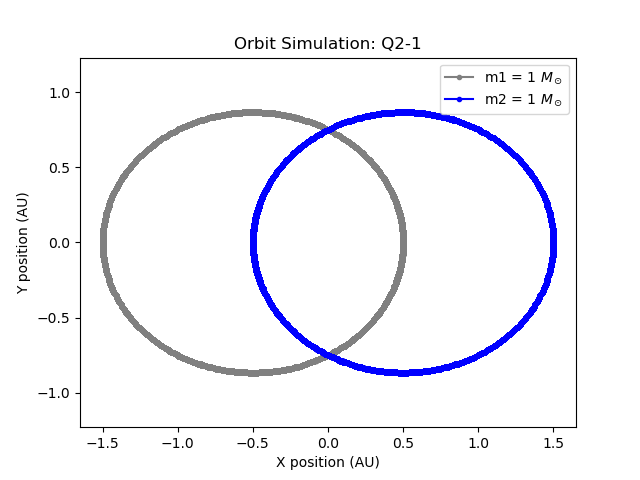
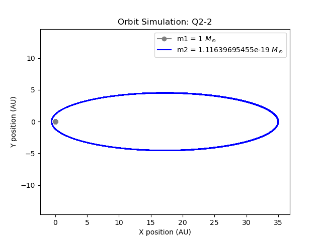
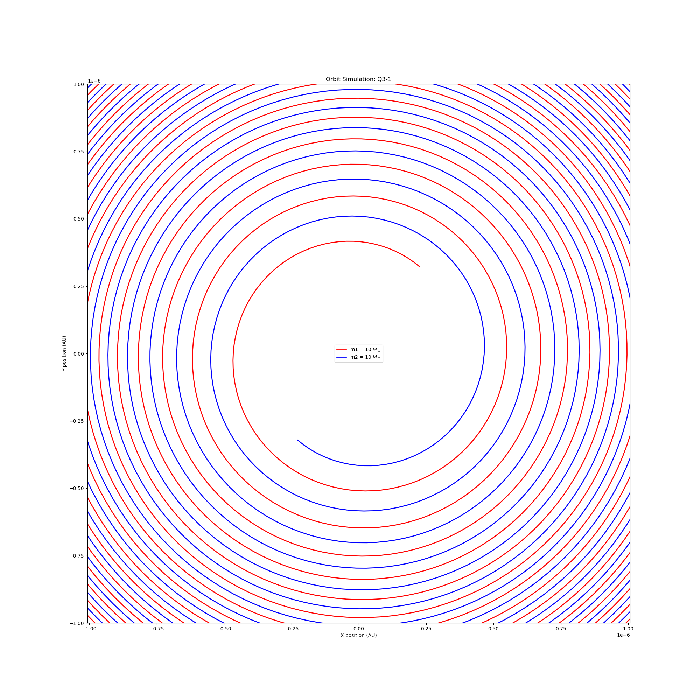
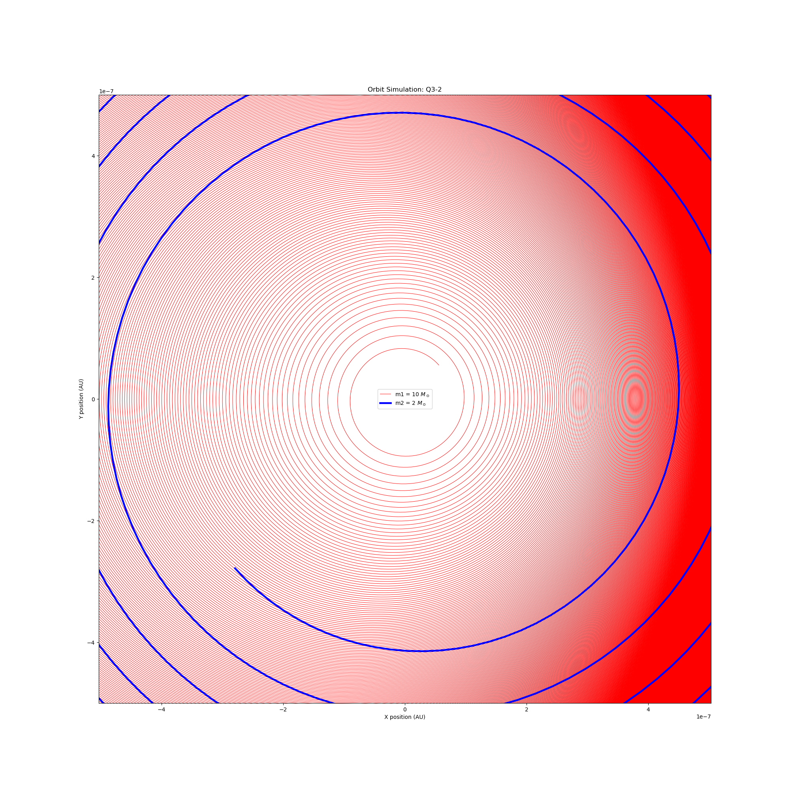

# 2bodymerger

**한국어** | [English](#english)

---

## 한국어

### 개요

2024.01 수치상대론 겨울학교 수치 천체물리 부문 문제풀이 코드입니다.
블랙홀·중성자별 쌍성의 궤도를 수치적으로 적분하고, 중력파 방출에 의한 나선형 합체 과정을 시뮬레이션합니다.

### 알고리즘: 4차 Hermite Predictor-Corrector

현재 시간의 가속도 $\mathbf{a}_0$와 그 시간 미분(jerk) $\dot{\mathbf{a}}_0$로부터
테일러 전개를 통해 다음 위치·속도를 **예측**한다.

$$\mathbf{r}_p = \mathbf{r}_0 + \mathbf{v}_0\Delta t + \mathbf{a}_0\frac{\Delta t^2}{2} + \dot{\mathbf{a}}_0\frac{\Delta t^3}{6}$$

$$\mathbf{v}_p = \mathbf{v}_0 + \mathbf{a}_0\Delta t + \dot{\mathbf{a}}_0\frac{\Delta t^2}{2}$$

예측된 위치에서 $\mathbf{a}_p$, $\dot{\mathbf{a}}_p$를 다시 계산하고,
predictor와 corrector의 차이로부터 고차 미분을 역산한다.

$$\dddot{\mathbf{a}}_0 = 12\frac{\mathbf{a}_0 - \mathbf{a}_p}{\Delta t^3} + 6\frac{\dot{\mathbf{a}}_0 + \dot{\mathbf{a}}_p}{\Delta t^2}$$

$$\ddot{\mathbf{a}}_0 = -6\frac{\mathbf{a}_0 - \mathbf{a}_p}{\Delta t^2} - 2\frac{2\dot{\mathbf{a}}_0 + \dot{\mathbf{a}}_p}{\Delta t}$$

이를 이용해 위치·속도를 **보정**한다.

$$\mathbf{r}_1 = \mathbf{r}_p + \ddot{\mathbf{a}}_0\frac{\Delta t^4}{24} + \dddot{\mathbf{a}}_0\frac{\Delta t^5}{120}$$

$$\mathbf{v}_1 = \mathbf{v}_p + \ddot{\mathbf{a}}_0\frac{\Delta t^3}{6} + \dddot{\mathbf{a}}_0\frac{\Delta t^4}{24}$$

위치에 대해 5차, 전체 계산에 대해 4차 정밀도를 달성한다.

### 2.5PN 복사 반력

$M = m_1 + m_2$, $\eta = m_1 m_2 / M^2$ 으로 정의할 때,
2.5PN 복사 반력 가속도는 다음과 같다.

$$\mathbf{a}_{\rm PN} = \frac{m_j}{r^2}\left(A\frac{\mathbf{R}}{r} + B\mathbf{V}\right)$$

$$A = \frac{8}{5}\eta\frac{M}{r}\dot{r}\left(\frac{17}{3}\frac{M}{r} + 3v^2\right), \qquad
B = -\frac{8}{5}\eta\frac{M}{r}\left(3\frac{M}{r} + v^2\right)$$

Hermite 적분기는 가속도의 시간 미분(jerk)을 요구하므로,
$\dot{\mathbf{a}}_{\rm PN}$ 계산을 위해 $\dot{A}$, $\dot{B}$를 직접 유도하여 구현했다.

$$\dot{A} = \frac{8}{5}\eta M\left[\frac{17}{3}M\left(\frac{\ddot{r}}{r^2} - \frac{2\dot{r}^2}{r^3}\right) + 3\left(\frac{\ddot{r}v^2}{r} - \frac{\dot{r}^2 v^2}{r^2} + \frac{2\dot{r}v\dot{v}}{r}\right)\right]$$

$$\dot{B} = \frac{8}{5}\eta\frac{M}{r^2}\dot{r}\left(3\frac{M}{r} + v^2\right) - \frac{8}{5}\eta\frac{M}{r}\left(-3\frac{M}{r^2}\dot{r} + 2\mathbf{V}\cdot\mathbf{a}\right)$$

여기서 $\ddot{r} = (v^2 + \mathbf{R}\cdot\mathbf{a} - \dot{r}^2)/r$, $\dot{v} = \mathbf{V}\cdot\mathbf{a}/v$.

### 구현 제약 사항

대회 규정상 외부 계산 라이브러리 사용 시 50% 감점 조건이 있었습니다.
물리 계산(가속도, 적분, dt 생성 등)은 직접 구현하고, numpy는 배열/인덱싱 용도로만 사용했습니다.

### 단위계

계산 편의상 G = 1, 질량 단위 M☉, 거리 단위 AU 의 코드 단위계를 사용합니다.

```
속도 변환상수 : (G · M☉ / AU)^0.5  [cm/s → 코드 단위]
시간 변환상수 : (AU³ / G · M☉)^0.5  [코드 단위 → s]
빛의 속도     : 코드 단위로 환산하여 사용
```

### 파일 구성

```
main.py       진입점. JSON 설정 파일을 읽어 시뮬레이션 실행
function.py   Hermite 적분기, 뉴턴/PN 가속도, 궤도 시뮬레이션, 시각화
input*        문제별 입력 파라미터 (JSON)
image/        궤도 시뮬레이션 결과 그림
```

### 결과

#### 문제 1 — 원 궤도

| Q1-2: 1+1 M☉, a=2AU, e=0 | Q1-4: 10+2 M☉, a=100AU, e=0 |
|:---:|:---:|
|  |  |

#### 문제 2 — 타원 궤도

| Q2-1: 1+1 M☉, a=2AU, e=0.5 | Q2-2: 핼리 혜성, a=17.8AU, e=0.967 |
|:---:|:---:|
|  |  |

#### 문제 3 — 중력파 방출 (2.5PN)

| Q3-1: 10+10 M☉, a=2×10⁻⁵AU, e=0 | Q3-2: 10+2 M☉, a=2×10⁻⁵AU, e=0.8 |
|:---:|:---:|
|  |  |

중력파 방출에 의해 궤도가 나선형으로 수축하며 두 천체가 합체에 이르는 과정을 확인할 수 있습니다.
슈바르츠실트 반지름 이하로 거리가 좁혀지면 합체로 판정하고 적분을 종료합니다.

---

## English

### Overview

Solution code for the Numerical Astrophysics section of the 2024.01 Numerical Relativity Winter School.
Numerically integrates the orbits of black hole and neutron star binary systems,
and simulates the inspiral merger process driven by gravitational wave emission.

### Algorithm: 4th-order Hermite Predictor-Corrector

Given the acceleration $\mathbf{a}_0$ and its time derivative (jerk) $\dot{\mathbf{a}}_0$,
the next position and velocity are **predicted** via Taylor expansion:

$$\mathbf{r}_p = \mathbf{r}_0 + \mathbf{v}_0\Delta t + \mathbf{a}_0\frac{\Delta t^2}{2} + \dot{\mathbf{a}}_0\frac{\Delta t^3}{6}$$

$$\mathbf{v}_p = \mathbf{v}_0 + \mathbf{a}_0\Delta t + \dot{\mathbf{a}}_0\frac{\Delta t^2}{2}$$

Accelerations $\mathbf{a}_p$, $\dot{\mathbf{a}}_p$ are recomputed at the predicted position.
Higher-order derivatives are back-solved from the predictor-corrector difference:

$$\dddot{\mathbf{a}}_0 = 12\frac{\mathbf{a}_0 - \mathbf{a}_p}{\Delta t^3} + 6\frac{\dot{\mathbf{a}}_0 + \dot{\mathbf{a}}_p}{\Delta t^2}, \qquad
\ddot{\mathbf{a}}_0 = -6\frac{\mathbf{a}_0 - \mathbf{a}_p}{\Delta t^2} - 2\frac{2\dot{\mathbf{a}}_0 + \dot{\mathbf{a}}_p}{\Delta t}$$

Position and velocity are then **corrected**:

$$\mathbf{r}_1 = \mathbf{r}_p + \ddot{\mathbf{a}}_0\frac{\Delta t^4}{24} + \dddot{\mathbf{a}}_0\frac{\Delta t^5}{120}, \qquad
\mathbf{v}_1 = \mathbf{v}_p + \ddot{\mathbf{a}}_0\frac{\Delta t^3}{6} + \dddot{\mathbf{a}}_0\frac{\Delta t^4}{24}$$

This achieves 5th-order accuracy in position and 4th-order overall.

### 2.5PN Radiation Reaction

With $M = m_1 + m_2$ and $\eta = m_1 m_2 / M^2$, the 2.5PN radiation-reaction acceleration is:

$$\mathbf{a}_{\rm PN} = \frac{m_j}{r^2}\left(A\frac{\mathbf{R}}{r} + B\mathbf{V}\right)$$

$$A = \frac{8}{5}\eta\frac{M}{r}\dot{r}\left(\frac{17}{3}\frac{M}{r} + 3v^2\right), \qquad
B = -\frac{8}{5}\eta\frac{M}{r}\left(3\frac{M}{r} + v^2\right)$$

Because the Hermite integrator requires the jerk of every force term,
$\dot{A}$ and $\dot{B}$ were analytically derived and implemented:

$$\dot{A} = \frac{8}{5}\eta M\left[\frac{17}{3}M\left(\frac{\ddot{r}}{r^2} - \frac{2\dot{r}^2}{r^3}\right) + 3\left(\frac{\ddot{r}v^2}{r} - \frac{\dot{r}^2 v^2}{r^2} + \frac{2\dot{r}v\dot{v}}{r}\right)\right]$$

$$\dot{B} = \frac{8}{5}\eta\frac{M}{r^2}\dot{r}\left(3\frac{M}{r} + v^2\right) - \frac{8}{5}\eta\frac{M}{r}\left(-3\frac{M}{r^2}\dot{r} + 2\mathbf{V}\cdot\mathbf{a}\right)$$

where $\ddot{r} = (v^2 + \mathbf{R}\cdot\mathbf{a} - \dot{r}^2)/r$ and $\dot{v} = \mathbf{V}\cdot\mathbf{a}/v$.

### Implementation Constraints

The competition rules imposed a 50% score penalty for using external calculation libraries.
Physical computations (accelerations, integration, timestep generation) were implemented from scratch;
numpy was used only for array storage and indexing.

### Unit System

Calculations use code units with G = 1, mass in M☉, distance in AU.

```
Velocity conversion : (G · M☉ / AU)^0.5  [code units → cm/s]
Time conversion     : (AU³ / G · M☉)^0.5  [code units → s]
Speed of light      : converted to code units
```

### File Structure

```
main.py       Entry point. Reads JSON config and runs simulation.
function.py   Hermite integrator, Newtonian/PN accelerations, orbit simulation, visualization.
input*        Per-problem input parameters (JSON).
image/        Output orbit plots.
```

### Results

#### Problem 1 — Circular Orbits

| Q1-2: 1+1 M☉, a=2AU, e=0 | Q1-4: 10+2 M☉, a=100AU, e=0 |
|:---:|:---:|
|  |  |

#### Problem 2 — Elliptical Orbits

| Q2-1: 1+1 M☉, a=2AU, e=0.5 | Q2-2: Halley's Comet, a=17.8AU, e=0.967 |
|:---:|:---:|
|  |  |

#### Problem 3 — Gravitational Wave Emission (2.5PN)

| Q3-1: 10+10 M☉, a=2×10⁻⁵AU, e=0 | Q3-2: 10+2 M☉, a=2×10⁻⁵AU, e=0.8 |
|:---:|:---:|
|  |  |

The plots show the inspiral trajectory as gravitational wave emission gradually shrinks the orbit.
Integration terminates when the separation falls below the Schwarzschild radius, signaling merger.
