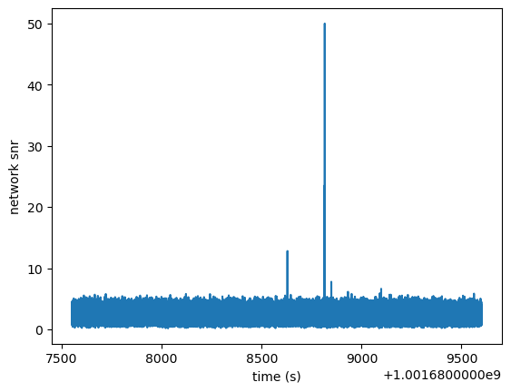

# ET_matched_filter

**한국어** | [English](#english)

---

## 한국어

### 개요

Einstein Telescope International R&D 활동의 일환으로 수행한
Mock Data Challenge(MDC) 분석 코드입니다.

PyCBC를 이용해 CBC(Compact Binary Coalescence) 파형 템플릿을 생성하고,
Einstein Telescope 3개 검출기(E1, E2, E3)의 antenna pattern을 적용한
matched filtering으로 network SNR을 계산합니다.

### 분석 흐름

1. MDC 데이터 파일(`.gwf`) 로드 및 분석 구간 crop
2. Time series → Frequency series 변환
3. PSD 로드 및 길이 정렬
4. CBC 파라미터 기반 파형 템플릿 생성 (`IMRPhenomXPHM` / `IMRPhenomPv2_NRTidal`)
5. 각 검출기의 antenna pattern 적용하여 실제 템플릿 생성
6. Matched filtering으로 각 검출기 SNR 계산
7. Network SNR 계산 및 시각화

$$\rho_{\rm net} = \sqrt{|\rho_1|^2 + |\rho_2|^2 + |\rho_3|^2}$$

### 파형 모델

| 이벤트 타입 | Approximant |
|------------|-------------|
| BBH | `IMRPhenomXPHM` |
| BHNS, NSNS | `IMRPhenomPv2_NRTidal` |

### 결과 예시

아래는 BBH 이벤트 (index 44413, 카탈로그 SNR=43.4) 에 대한 network SNR 시계열이다.



Matched filtering 결과 peak SNR ≈ 50 이 카탈로그 병합 시각 근방에서 검출된다.

### 파일 구성

```
ET_matched_filter.py   분석 메인 코드
image/                 결과 그림
```

MDC 데이터 파일 및 CBC 카탈로그(`list_etmdc1.xlsx`)는 미포함입니다.

### 참고

- PyCBC 파형 파라미터: [pycbc/waveform/parameters.py](https://github.com/gwastro/pycbc/blob/master/pycbc/waveform/parameters.py)
- IMRPhenomX 파라미터 설명: [LALSimulation docs](https://lscsoft.docs.ligo.org/lalsuite/lalsimulation/group___l_a_l_sim_i_m_r_phenom_x__c.html)

---

## English

### Overview

Analysis code for the Einstein Telescope Mock Data Challenge (MDC),
performed as part of the Einstein Telescope International R&D activity.

Generates CBC waveform templates using PyCBC, applies antenna patterns
for the 3-detector ET network (E1, E2, E3), and computes network SNR
via matched filtering.

### Pipeline

1. Load MDC strain data (`.gwf`) and crop to analysis segment
2. Convert time series to frequency series
3. Load and interpolate PSD
4. Generate waveform template from CBC parameters (`IMRPhenomXPHM` / `IMRPhenomPv2_NRTidal`)
5. Apply per-detector antenna pattern to construct real template
6. Compute per-detector SNR via matched filtering
7. Compute and plot network SNR

$$\rho_{\rm net} = \sqrt{|\rho_1|^2 + |\rho_2|^2 + |\rho_3|^2}$$

### Waveform Models

| Event type | Approximant |
|------------|-------------|
| BBH | `IMRPhenomXPHM` |
| BHNS, NSNS | `IMRPhenomPv2_NRTidal` |

### Example Result

Network SNR time series for a BBH event (index 44413, catalog SNR=43.4).


Matched filtering recovers a peak SNR ≈ 50 near the catalog merger time.

### File Structure

```
ET_matched_filter.py   Main analysis script
image/                 Output plots
```

MDC strain data and CBC catalog (`list_etmdc1.xlsx`) are not included.

### References

- PyCBC waveform parameters: [pycbc/waveform/parameters.py](https://github.com/gwastro/pycbc/blob/master/pycbc/waveform/parameters.py)
- IMRPhenomX parameter documentation: [LALSimulation docs](https://lscsoft.docs.ligo.org/lalsuite/lalsimulation/group___l_a_l_sim_i_m_r_phenom_x__c.html)