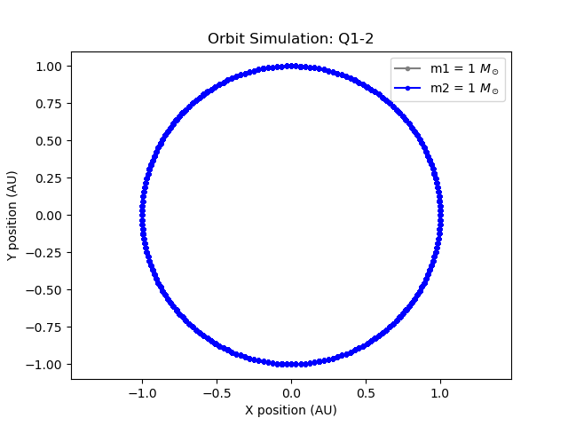
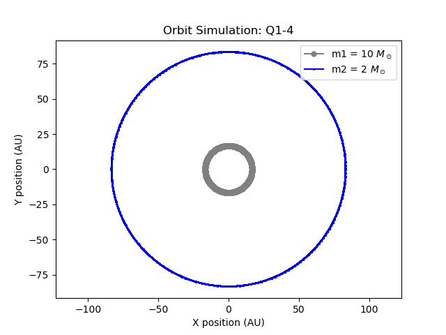

# 2bodymerger

**한국어** | [English](#english)

---

## 한국어

### 개요

2024.01 수치상대론 겨울학교 수치 천체물리 부문 문제풀이 코드입니다.
블랙홀·중성자별 쌍성의 궤도를 수치적으로 적분하고, 중력파 방출에 의한 나선형 합체 과정을 시뮬레이션합니다.

### 알고리즘

**4차 Hermite predictor-corrector** 방식을 사용합니다.

현재 시간의 가속도 **a** 와 그 시간 미분(jerk) **ȧ** 를 계산하여 다음 위치와 속도를 예측(predictor)한 뒤,
예측된 위치에서 다시 가속도를 계산해 3차·4차 미분을 역산하여 결과를 보정(corrector)합니다.
위치에 대해 5차, 전체 계산에 대해 4차 정밀도를 달성합니다.

중력파 방출 효과는 **2.5PN(post-Newtonian) 복사 반력 항**으로 반영합니다.
뉴턴 가속도에 Burke-Thorne radiation reaction 항을 더하며,
Hermite 적분기가 jerk를 요구하기 때문에 PN 항에 대해서도 시간 미분을 직접 유도하여 구현했습니다.

### 구현 제약 사항

대회 규정상 **numpy를 포함한 외부 라이브러리 사용 시 50% 감점** 조건이 있었습니다.
따라서 원본 코드는 사칙연산만으로 작성되었습니다.

- `abs_vector()` : `np.linalg.norm` 대신 직접 구현한 벡터 크기 함수
- `pi = 3.14159` : 문제에서 지정한 상수값 그대로 사용
- `dt_list` 생성 : numpy 없이 Python 리스트 연산으로 구현

### 단위계

계산 편의상 G = 1, 질량 단위 M☉, 거리 단위 AU 의 코드 단위계를 사용합니다.

```
속도 변환상수 : (G · M☉ / AU)^0.5  [cm/s → 코드 단위]
시간 변환상수 : (AU³ / G · M☉)^0.5  [코드 단위 → s]
빛의 속도     : 코드 단위로 환산하여 사용
```

### 파일 구성

```
main.py       진입점. JSON 설정 파일을 읽어 시뮬레이션 실행
function.py   Hermite 적분기, 뉴턴/PN 가속도, 궤도 시뮬레이션, 시각화
input*        문제별 입력 파라미터 (JSON)
image/        궤도 시뮬레이션 결과 그림
```

### 결과

#### 문제 1 — 원 궤도

| Q1-2: 1+1 M☉, a=2AU, e=0 | Q1-4: 10+2 M☉, a=100AU, e=0 |
|:---:|:---:|
|  |  |

#### 문제 2 — 타원 궤도

| Q2-1: 1+1 M☉, a=2AU, e=0.5 | Q2-2: 핼리 혜성, a=17.8AU, e=0.967 |
|:---:|:---:|
|  |  |

#### 문제 3 — 중력파 방출 (2.5PN)

| Q3-1: 10+10 M☉, a=2×10⁻⁵AU, e=0 | Q3-2: 10+2 M☉, a=2×10⁻⁵AU, e=0.8 |
|:---:|:---:|
|  |  |

중력파 방출에 의해 궤도가 나선형으로 수축하며 두 천체가 합체에 이르는 과정을 확인할 수 있습니다.
슈바르츠실트 반지름 이하로 거리가 좁혀지면 합체로 판정하고 적분을 종료합니다.

---

## English

### Overview

Solution code for the Numerical Astrophysics section of the 2024.01 Numerical Relativity Winter School.
Numerically integrates the orbits of black hole and neutron star binary systems,
and simulates the inspiral merger process driven by gravitational wave emission.

### Algorithm

Uses a **4th-order Hermite predictor-corrector** scheme.

At each timestep, the gravitational acceleration **a** and its time derivative (jerk) **ȧ** are computed.
A predictor step advances position and velocity via Taylor expansion,
then the corrector back-solves for the 2nd and 3rd time derivatives of acceleration to refine the result.
This achieves 5th-order accuracy in position and 4th-order overall.

Gravitational wave emission is incorporated via a **2.5PN (post-Newtonian) radiation-reaction term**.
The Burke-Thorne radiation reaction force is added on top of the Newtonian acceleration.
Because the Hermite integrator requires the jerk of every force term,
the time derivative of the PN acceleration was derived and implemented analytically.

### Implementation Constraints

The competition rules imposed a **50% score penalty for using external libraries including numpy**.
The original code is therefore written using only arithmetic operations.

- `abs_vector()` : hand-implemented vector norm instead of `np.linalg.norm`
- `pi = 3.14159` : exact constant specified by the problem statement
- `dt_list` construction : implemented with pure Python list operations

### Unit System

Calculations use code units with G = 1, mass in M☉, distance in AU.

```
Velocity conversion : (G · M☉ / AU)^0.5  [code units → cm/s]
Time conversion     : (AU³ / G · M☉)^0.5  [code units → s]
Speed of light      : converted to code units
```

### File Structure

```
main.py       Entry point. Reads JSON config and runs simulation.
function.py   Hermite integrator, Newtonian/PN accelerations, orbit simulation, visualization.
input*        Per-problem input parameters (JSON).
image/        Output orbit plots.
```

### Results

#### Problem 1 — Circular Orbits

| Q1-2: 1+1 M☉, a=2AU, e=0 | Q1-4: 10+2 M☉, a=100AU, e=0 |
|:---:|:---:|
|  |  |

#### Problem 2 — Elliptical Orbits

| Q2-1: 1+1 M☉, a=2AU, e=0.5 | Q2-2: Halley's Comet, a=17.8AU, e=0.967 |
|:---:|:---:|
|  |  |

#### Problem 3 — Gravitational Wave Emission (2.5PN)

| Q3-1: 10+10 M☉, a=2×10⁻⁵AU, e=0 | Q3-2: 10+2 M☉, a=2×10⁻⁵AU, e=0.8 |
|:---:|:---:|
|  |  |

The plots show the inspiral trajectory as gravitational wave emission gradually shrinks the orbit.
Integration terminates when the separation falls below the Schwarzschild radius, signaling merger.
