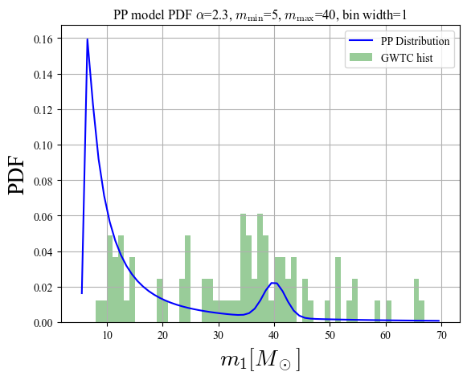
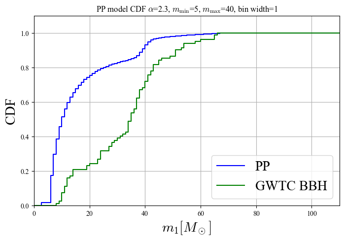

# massdistribution

**한국어** | [English](#english)

---

## 한국어

### 개요

GWTC(Gravitational Wave Transient Catalog) BBH 이벤트의 m1 분포를 이론 모델에 피팅하고
KS(Kolmogorov-Smirnov) 검정으로 적합도를 평가한 코드입니다.

동기의 중력파 데이터 분석 연구를 지원하는 과정에서 작성했으며,
**두 질량 분포 모델의 구현을 전담**했습니다.

두 모델은 [Abbott et al. (2021)](https://iopscience.iop.org/article/10.3847/2041-8213/abe949) 에서 제안된 BBH 질량 분포 모델을 구현한 것입니다.

### 모델

#### Truncated Power Law

$[m_{\min}, m_{\max}]$ 구간에서 $p(m) \propto m^{-\alpha}$ 인 단순 멱함수 분포.
구간 밖은 0으로 절단한다.
CDF는 Gauss-Legendre 수치적분으로 계산한다.

#### Power + Peak (PP)

$$\pi(m_1 \mid \lambda_{\rm peak}, \alpha, m_{\min}, \delta_m, m_{\max}, \mu_m, \sigma_m)$$

$$= \left[(1 - \lambda_{\rm peak})\,\mathfrak{P}(m_1 \mid -\alpha, m_{\max}) + \lambda_{\rm peak}\,G(m_1 \mid \mu_m, \sigma_m)\right] S(m_1 \mid m_{\min}, \delta_m)$$

멱함수 성분 $\mathfrak{P}$ 와 가우시안 성분 $G$ 를 $\lambda_{\rm peak}$ 비율로 혼합한다.

**Smooth window** $S(m)$ 은 $m_{\min}$ 근방의 급격한 절단을 부드럽게 처리한다.

$$S(m \mid m_{\min}, \delta_m) = \begin{cases}
0 & (m < m_{\min}) \\
\left[f(m - m_{\min}, \delta_m) + 1\right]^{-1} & (m_{\min} \leq m < m_{\min} + \delta_m) \\
1 & (m \geq m_{\min} + \delta_m)
\end{cases}$$

$$f(m', \delta_m) = \exp\left(\frac{\delta_m}{m'} + \frac{\delta_m}{m' - \delta_m}\right)$$

**물리적 동기**

- **저질량 영역** — smooth window로 hard cutoff 회피. 관측 선택 효과와 별 진화 물리를 반영.
- **고질량 영역** — 가우시안 peak 항 추가. Pulsational pair-instability supernovae(PPISN)에 의한 질량 손실로 pair-instability gap 직전에 BBH 이벤트가 쌓이는 현상(pileup)을 모델링.

### 적분 방법

두 모델에서 의도적으로 다른 적분 방법을 사용한다.

| 모델 | 방법 | 이유 |
|------|------|------|
| Truncated | Gauss-Legendre 수치적분 | 멱함수 CDF를 구간별로 정확하게 적분 |
| PP | `np.trapz` | 혼합 분포 형태가 복잡하여 수치 정규화 |

### 결과 예시 (PP 모델)

| PDF | CDF |
|:---:|:---:|
|  |  |

### 구조

```
models.py   KSTestBase (공통), KSTruncated, KSPP
run.py      데이터 로드, 모델 실행, KS 검정 결과 출력
data/       데이터 파일 미포함 (아래 참고)
```

### 데이터

GWTC 카탈로그 기반 BBH 이벤트 데이터.
저작권 문제로 데이터 파일은 레포에 포함하지 않습니다.

원본 카탈로그: https://gwosc.org/eventapi/

---

## English

### Overview

Fits theoretical mass distribution models to the GWTC BBH m1 distribution
and evaluates goodness-of-fit using the Kolmogorov-Smirnov test.

Written to support a collaborator's gravitational wave data analysis research.
**Responsible for implementing both mass distribution models.**

Both models are implementations of the BBH mass distribution models proposed in [Abbott et al. (2021)](https://iopscience.iop.org/article/10.3847/2041-8213/abe949).

### Models

#### Truncated Power Law

Simple power law $p(m) \propto m^{-\alpha}$ over $[m_{\min}, m_{\max}]$, zero outside.
CDF computed via Gauss-Legendre quadrature.

#### Power + Peak (PP)

$$\pi(m_1 \mid \lambda_{\rm peak}, \alpha, m_{\min}, \delta_m, m_{\max}, \mu_m, \sigma_m)$$

$$= \left[(1 - \lambda_{\rm peak})\,\mathfrak{P}(m_1 \mid -\alpha, m_{\max}) + \lambda_{\rm peak}\,G(m_1 \mid \mu_m, \sigma_m)\right] S(m_1 \mid m_{\min}, \delta_m)$$

A mixture of a power law component $\mathfrak{P}$ and a Gaussian component $G$,
weighted by $\lambda_{\rm peak}$.

**Smooth window** $S(m)$ softens the sharp low-mass cutoff:

$$S(m \mid m_{\min}, \delta_m) = \begin{cases}
0 & (m < m_{\min}) \\
\left[f(m - m_{\min}, \delta_m) + 1\right]^{-1} & (m_{\min} \leq m < m_{\min} + \delta_m) \\
1 & (m \geq m_{\min} + \delta_m)
\end{cases}$$

$$f(m', \delta_m) = \exp\left(\frac{\delta_m}{m'} + \frac{\delta_m}{m' - \delta_m}\right)$$

**Physical motivation**

- **Low masses** — smooth window avoids a hard cutoff, reflecting observational selection effects and stellar evolution physics.
- **High masses** — Gaussian peak models the pileup of BBH events just before the pair-instability mass gap, caused by mass loss undergone by pulsational pair-instability supernovae (PPISN).

### Integration Methods

The two models intentionally use different integration strategies.

| Model | Method | Reason |
|-------|--------|--------|
| Truncated | Gauss-Legendre quadrature | Accurate bin-by-bin CDF integration of power law |
| PP | `np.trapz` | Mixed distribution shape requires numerical normalization |

### Example Results (PP Model)

| PDF | CDF |
|:---:|:---:|
|  |  |

### Structure

```
models.py   KSTestBase (shared), KSTruncated, KSPP
run.py      Data loading, model execution, KS test output
data/       Data files not included (see below)
```

### Data

BBH event data based on the GWTC catalog.
Data files are not included in this repository due to copyright.

Original catalog: https://gwosc.org/eventapi/
